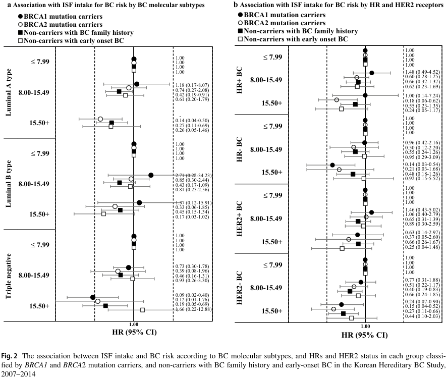

# Isoflavone Intake and Hereditary Breast Cancer Risk

This repository summarizes my first-author publication in *Breast Cancer Research and Treatment* (2020) on the impact of isoflavone (ISF) intake on the risk of breast cancer and its molecular subtypes among women at high risk for hereditary breast cancer.

## 🧪 Study Overview
- **Study type**: Retrospective cohort (n = 1,709)
- **Population**: Korean women from the KOHBRA study (BRCA1/2 carriers and high-risk non-carriers)
- **Outcome**: Risk of breast cancer and molecular subtypes (Luminal A/B, HER2+, TNBC)
- **Exposure**: Daily isoflavone intake from a validated food frequency questionnaire (FFQ)

## 📊 Statistical Analysis
- SAS 9.4
- Weighted Cox proportional hazard models
- Case-only logistic regression for gene-environment interaction

## 📊 Key Finding: Isoflavone Intake and Breast Cancer Risk

## 📁 What’s Included
- `sas_code/`: Key analysis scripts (mock version)
- `study_overview.md`: Description of the study design and key variables
- `publication_link.md`: Citation and journal link

## 📄 Publication
**Sim, Eun Ji**, et al. Isoflavone intake on the risk of overall breast cancer and molecular subtypes in women at high risk for hereditary breast cancer. *Breast Cancer Res Treat*. 2020.  
🔗 https://doi.org/10.1007/s10549-020-05875-0

> Note: Data is not shared due to privacy and institutional restrictions. Code has been adapted for public display using mock variable names and structure.
